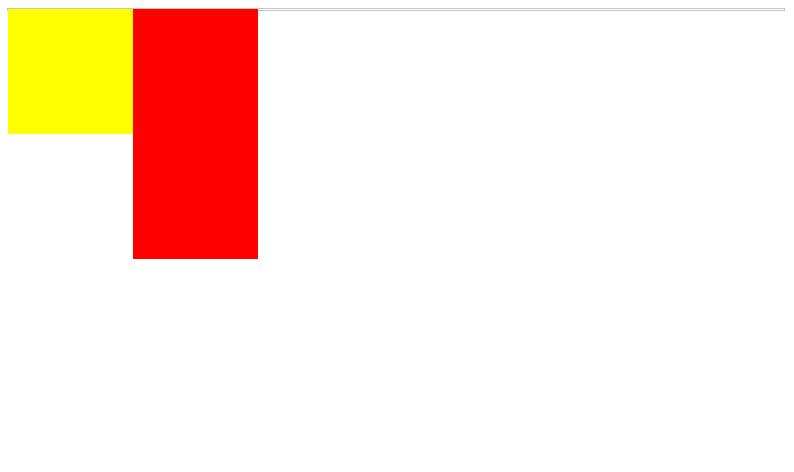
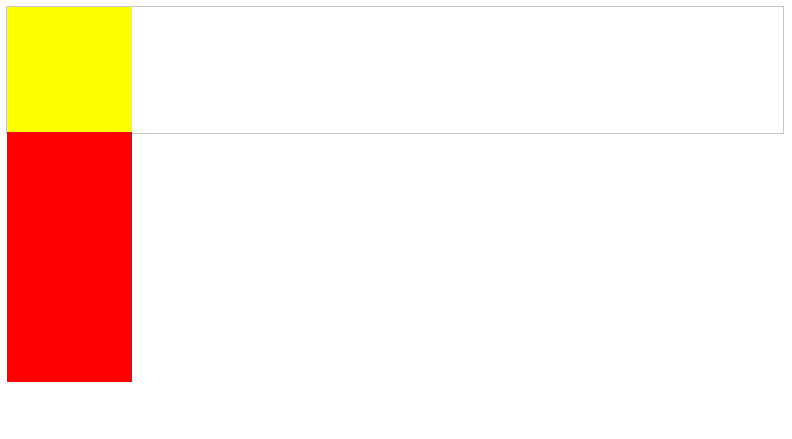
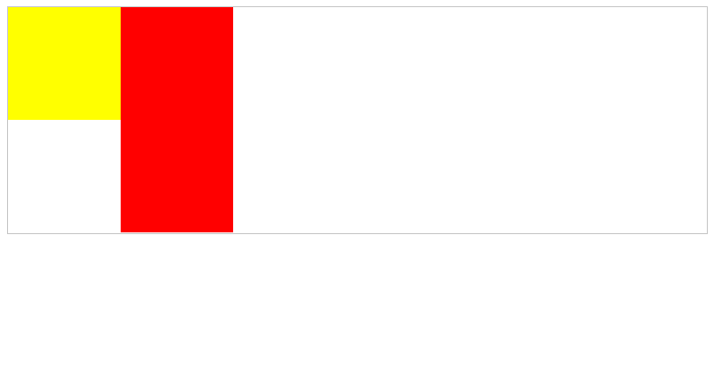

首先定义如下几个div。
``` html
<!DOCTYPE HTML>
<html>
<body>
<style>
.container{
  border: 1px solid #c5c5c5;
}
</style>
<div class="container clearfix">
<div id="first" style="width:100px;height:100px;background-color:yellow;float:left;"></div>
<div style="width:100px;height:200px;background-color:red;float:left"></div>
</div>
</body>
</html>
```
此时可以发现，两个``div``元素行内对齐排列，加了浮动之后的元素脱离了标准流，所以父容器出现了高度塌陷。

清除浮动的方法有以下几个：
- 增加一个空的``div``元素
``` html
<div style="clear:both"></div>
```

- 为父级元素增加``overflow:hidden``属性。
``` css
.container{
  border: 1px solid #c5c5c5;
  overflow: hidden;
}
```

- 为父级元素增加伪元素。
``` css
.clearfix:before,
.clearfix:after {
    display: table;
    content: " ";
}
.clearfix:after {
    clear: both;
}
.clearfix{
    *zoom: 1;
}
```
